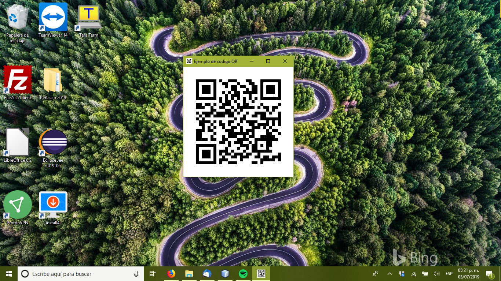
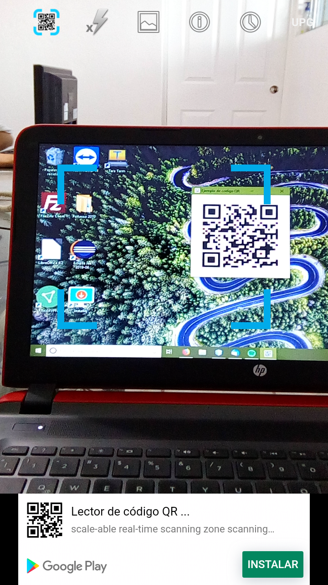
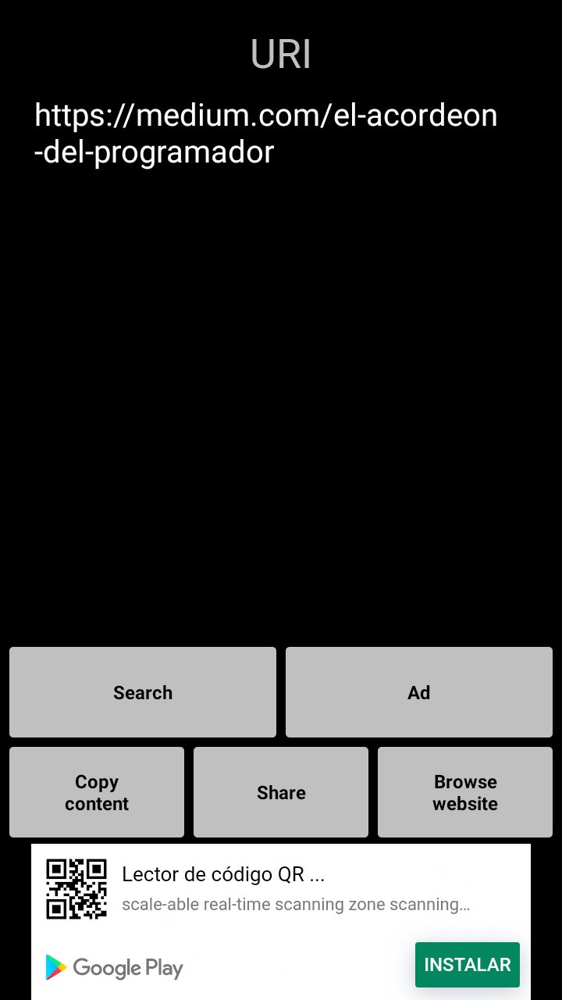

# Creando codigos QR en Java



Si ha visto un recibo, una factura o un poster estos dias seguro ya notó que la
mayoria contiene un código QR que contiene o los datos de su factura/ticket o
un enlace para la app de lo que sea que estan anunciando y bueno si ya son tan
comunes, ¿Que tal si aprendemos a hacerlos?, veamos como.

## ZXing
La libreria ZXing desarollada por Google nos permite tomar una cadena de texto,
codificarla como una matriz de datos la cual luego se puede convertir a un código 
QR con el cual podemos generar una imagen en el formato que necesitemos.

El uso de la libreria es muy sencillo el cual consiste de los siguientes pasos:

1. Crear un objeto QRCodeWriter.
2. Crear una cadena de texto con los datos que deseamos poner en el QR.
3. Tener a la mano el ancho y altura del código QR que deseamos crear
4. Usar el método encode del objeto QRCodeWriter para crear la matriz de datos del QR, se le pasan de argumentos los datos, el ancho y altura que deseamos ver en el QR
5. Crear un objeto BufferedImage del mismo exacto tamaño que el código QR.
6. Llendo elemento por elemento de la matriz de datos convertirlo a una imagen BufferedImage.
7. Usar ese objeto BufferedImage ya sea para mostrar el Código QR en pantalla, imprimirlo o guardarlo.

Esto puede sonar complicado, pero con una sola función en Java puede hacer todo esto, como se ve a continuación.

```java
public BufferedImage crearQR(String datos, int ancho, int altura) throws WriterException {
    BitMatrix matrix;
    Writer escritor = new QRCodeWriter();
    matrix = escritor.encode(datos, BarcodeFormat.QR_CODE, ancho, altura);
        
    BufferedImage imagen = new BufferedImage(ancho, altura, BufferedImage.TYPE_INT_RGB);
        
    for(int y = 0; y < altura; y++) {
        for(int x = 0; x < ancho; x++) {
            int grayValue = (matrix.get(x, y) ? 0 : 1) & 0xff;
            imagen.setRGB(x, y, (grayValue == 0 ? 0 : 0xFFFFFF));
        }
    }
        
    return imagen;        
}
```

Esta función toma los tres argumentos que se habian mencionado, una cadena de texto 
que codificar en el QR, el ancho del QR y la altura del QR, no es necesario pero se 
recomienda el QR sea cuadrado

Note que la cadena de texto puede contener el mensaje que desee, sea una URL, el 
enlace a una App o un mensaje que desee, lo que ponga ahi aparecera al momento de
leer el QR.

## Ejemplo.

Suficiente teoria, pongamos las manos a la obra hagamos un programa que nos muestre
un QR en pantalla, para esto usaremos tres clases Java.

Primero la clase con la función que mencionamos previamente que contiene la función
que vimos previamente.

```java
/*
 * To change this license header, choose License Headers in Project Properties.
 * To change this template file, choose Tools | Templates
 * and open the template in the editor.
 */
package mx.com.pydee.ejemploqr;

import com.google.zxing.BarcodeFormat;
import com.google.zxing.Writer;
import com.google.zxing.WriterException;
import com.google.zxing.common.BitMatrix;
import com.google.zxing.qrcode.QRCodeWriter;
import java.awt.image.BufferedImage;

/**
 *
 * @author David
 */
public class GeneraQR {
    
    public BufferedImage crearQR(String datos, int ancho, int altura) throws WriterException {
        BitMatrix matrix;
        Writer escritor = new QRCodeWriter();
        matrix = escritor.encode(datos, BarcodeFormat.QR_CODE, ancho, altura);
        
        BufferedImage imagen = new BufferedImage(ancho, altura, BufferedImage.TYPE_INT_RGB);
        
        for(int y = 0; y < altura; y++) {
            for(int x = 0; x < ancho; x++) {
                int grayValue = (matrix.get(x, y) ? 0 : 1) & 0xff;
                imagen.setRGB(x, y, (grayValue == 0 ? 0 : 0xFFFFFF));
            }
        }
        
        return imagen;        
    }    
}
```

Luego la ventana JFrame para poner el BufferedImage en pantalla este lo usaremos para
crear el ImageIcon que mostraremos en la pantalla y como el icono de la ventana.

```java
/*
 * To change this license header, choose License Headers in Project Properties.
 * To change this template file, choose Tools | Templates
 * and open the template in the editor.
 */
package mx.com.pydee.ejemploqr;

import com.google.zxing.WriterException;
import java.awt.image.BufferedImage;
import javax.swing.ImageIcon;
import javax.swing.JFrame;
import javax.swing.JLabel;

/**
 *
 * @author David
 */
public class Ventana extends JFrame {
    
    public Ventana() throws WriterException {
        GeneraQR generaQR = new GeneraQR();
        BufferedImage imagen = generaQR.crearQR("https://medium.com/el-acordeon-del-programador", 300, 300);
        ImageIcon icono = new ImageIcon(imagen);
        JLabel etiqueta = new JLabel("");
        
        etiqueta.setIcon(icono);
        
        this.setIconImage(imagen);
        this.setDefaultCloseOperation(JFrame.EXIT_ON_CLOSE);
        this.setTitle("Ejemplo de codigo QR");
        this.getContentPane().add(etiqueta);
        this.pack();        
    }
}
```

y finalmente la clase main para iniciar el programa

```java
/*
 * To change this license header, choose License Headers in Project Properties.
 * To change this template file, choose Tools | Templates
 * and open the template in the editor.
 */
package mx.com.pydee.ejemploqr;

import com.google.zxing.WriterException;
import java.util.logging.Level;
import java.util.logging.Logger;

/**
 *
 * @author David
 */
public class EjemploQR {
    static public void main(String[] args) {
        try {
            Ventana ventana = new Ventana();
            
            ventana.setVisible(true);
            
        } catch (WriterException ex) {
            Logger.getLogger(EjemploQR.class.getName()).log(Level.SEVERE, null, ex);
        }
    }
}
```

Y ya que ejecute el programa vera en pantalla algo como se ve en la figura.


Y para demostrar que todo funciona, use el lector de QR de su preferencia, apunte a la pantalla.



Y vera la URL que aparce en el ejemplo.



Haga la prueba cambiando el mensaje en la función, corra de nuevo el programa y 
lea el QR, vera que eso es lo que le aparece.


## Referencias
Generación de Códigos QR en Java: https://angelborroy.wordpress.com/2011/09/02/generacion-de-codigos-qr-en-java/
